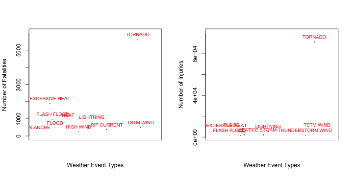
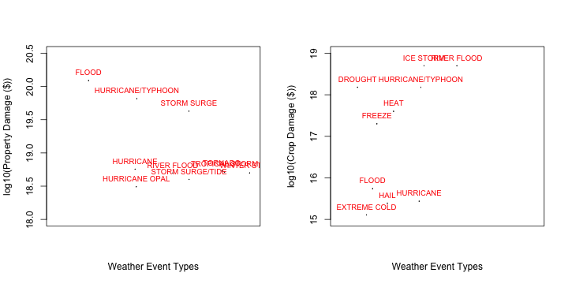

## Human and Economic Costs of Severe Weather Events - An analysis of NOAA's storm database.
============================================================================================

This document explores the U.S. National Oceanic and Atmospheric Administration's (NOAA) storm database. This database tracks characteristics of major stroms and weather events in the U.S, including when and where they occur, as well as estimates of any fatalities, injuries, and property damage. The main objective of this analysis is to find out which types of weather events are most harmful with respect to population health, in terms of number of fatalities and injuries, and also, which types of weather events have the greatest economic consequences, in terms of property and crop damage. 

### Data Proccessing

The storm database is read into the dataframe storm. The file 'repdata-data-StormData.csv.bz2' should be present in the directory.


```r
storm = read.csv(bzfile('repdata-data-StormData.csv.bz2'))
head(storm)
```

```
##   STATE__           BGN_DATE BGN_TIME TIME_ZONE COUNTY COUNTYNAME STATE
## 1       1  4/18/1950 0:00:00     0130       CST     97     MOBILE    AL
## 2       1  4/18/1950 0:00:00     0145       CST      3    BALDWIN    AL
## 3       1  2/20/1951 0:00:00     1600       CST     57    FAYETTE    AL
## 4       1   6/8/1951 0:00:00     0900       CST     89    MADISON    AL
## 5       1 11/15/1951 0:00:00     1500       CST     43    CULLMAN    AL
## 6       1 11/15/1951 0:00:00     2000       CST     77 LAUDERDALE    AL
##    EVTYPE BGN_RANGE BGN_AZI BGN_LOCATI END_DATE END_TIME COUNTY_END
## 1 TORNADO         0                                               0
## 2 TORNADO         0                                               0
## 3 TORNADO         0                                               0
## 4 TORNADO         0                                               0
## 5 TORNADO         0                                               0
## 6 TORNADO         0                                               0
##   COUNTYENDN END_RANGE END_AZI END_LOCATI LENGTH WIDTH F MAG FATALITIES
## 1         NA         0                      14.0   100 3   0          0
## 2         NA         0                       2.0   150 2   0          0
## 3         NA         0                       0.1   123 2   0          0
## 4         NA         0                       0.0   100 2   0          0
## 5         NA         0                       0.0   150 2   0          0
## 6         NA         0                       1.5   177 2   0          0
##   INJURIES PROPDMG PROPDMGEXP CROPDMG CROPDMGEXP WFO STATEOFFIC ZONENAMES
## 1       15    25.0          K       0                                    
## 2        0     2.5          K       0                                    
## 3        2    25.0          K       0                                    
## 4        2     2.5          K       0                                    
## 5        2     2.5          K       0                                    
## 6        6     2.5          K       0                                    
##   LATITUDE LONGITUDE LATITUDE_E LONGITUDE_ REMARKS REFNUM
## 1     3040      8812       3051       8806              1
## 2     3042      8755          0          0              2
## 3     3340      8742          0          0              3
## 4     3458      8626          0          0              4
## 5     3412      8642          0          0              5
## 6     3450      8748          0          0              6
```


```r
obs = dim(storm)[1]
var = dim(storm)[2]
```

The dataset contains 37 variables and 902297 observations. The most relevant variables for this analysis is EVTYPE, the type of weather event, FATALITIES and INJURIES, number of fatalities and injuries caused by the weather event, and PROPDMG and CROPDMG, the amount of property and crop damage in dollar units indicated in the variables PROPDMGEXP and CROPDMGEXP.

In order to find out the type of weather event that is most harmful to the health of the population, a new dataframe storm_health is created that summarizes the total number of fatalities and injuries for each type of weather event.


```r
library(plyr)
storm_health = ddply(storm, 'EVTYPE', summarize, Fatalities = sum(FATALITIES), Injuries = sum(INJURIES))
head(storm_health)
```

```
##                  EVTYPE Fatalities Injuries
## 1    HIGH SURF ADVISORY          0        0
## 2         COASTAL FLOOD          0        0
## 3           FLASH FLOOD          0        0
## 4             LIGHTNING          0        0
## 5             TSTM WIND          0        0
## 6       TSTM WIND (G45)          0        0
```

Now, consider the economic consequences in terms of property and crop damage. The variables PROPDMG and CROPDMG are estimates of the property and crop damage in units of K ($1000), m or M ($1000,000), and B ($1000,000,000) as given in the variables PROPDMGEXP and CROPDMGEXP. First, the PROPDMG and CROPDMG variables must be converted to units of dollars.


```r
storm[storm$PROPDMGEXP == 'B', ]$PROPDMG = storm[storm$PROPDMGEXP == 'B', ]$PROPDMG*1000000000
storm[storm$PROPDMGEXP %in% c('m', 'M'), ]$PROPDMG = 
    storm[storm$PROPDMGEXP %in% c('m', 'M'), ]$PROPDMG*1000000
storm[storm$PROPDMGEXP == 'K', ]$PROPDMG = storm[storm$PROPDMGEXP == 'K', ]$PROPDMG*1000

storm[storm$CROPDMGEXP == 'B', ]$CROPDMG = storm[storm$CROPDMGEXP == 'B', ]$CROPDMG*1000000000
storm[storm$CROPDMGEXP %in% c('m', 'M'), ]$CROPDMG = 
    storm[storm$CROPDMGEXP %in% c('m', 'M'), ]$CROPDMG*1000000
storm[storm$CROPDMGEXP == 'K', ]$CROPDMG = storm[storm$CROPDMGEXP == 'K', ]$CROPDMG*1000
```

The total property and crop damage in dollar amounts are then summed up for each type of weather event as before, in order to find out the weather events that cause the maximum amounts of property and crop damage.


```r
storm_econ = ddply(storm, 'EVTYPE', summarize, PropDmg = sum(PROPDMG), CropDmg = sum(CROPDMG))
head(storm_econ)
```

```
##                  EVTYPE PropDmg CropDmg
## 1    HIGH SURF ADVISORY  200000       0
## 2         COASTAL FLOOD       0       0
## 3           FLASH FLOOD   50000       0
## 4             LIGHTNING       0       0
## 5             TSTM WIND 8100000       0
## 6       TSTM WIND (G45)    8000       0
```

### Results

The 10 weather event types with the highest number of fatalities and injuries can be found as follows.


```r
storm_health1 = storm_health[order(storm_health$Fatalities, decreasing = TRUE), ]
storm_health1 = storm_health1[1:10, ]
storm_health1
```

```
##             EVTYPE Fatalities Injuries
## 834        TORNADO       5633    91346
## 130 EXCESSIVE HEAT       1903     6525
## 153    FLASH FLOOD        978     1777
## 275           HEAT        937     2100
## 464      LIGHTNING        816     5230
## 856      TSTM WIND        504     6957
## 170          FLOOD        470     6789
## 585    RIP CURRENT        368      232
## 359      HIGH WIND        248     1137
## 19       AVALANCHE        224      170
```

```r
storm_health2 = storm_health[order(storm_health$Injuries, decreasing = TRUE), ]
storm_health2 = storm_health2[1:10, ]
storm_health2
```

```
##                EVTYPE Fatalities Injuries
## 834           TORNADO       5633    91346
## 856         TSTM WIND        504     6957
## 170             FLOOD        470     6789
## 130    EXCESSIVE HEAT       1903     6525
## 464         LIGHTNING        816     5230
## 275              HEAT        937     2100
## 427         ICE STORM         89     1975
## 153       FLASH FLOOD        978     1777
## 760 THUNDERSTORM WIND        133     1488
## 244              HAIL         15     1361
```

The above information is plotted in the following figure.


```r
par(mfrow = c(1, 2))
plot(storm_health1$EVTYPE, storm_health1$Fatalities, pch = 19, cex = 2, 
     xaxt = 'n', ylim = c(0, 6000),  
     xlab = 'Weather Event Types', ylab = 'Number of Fatalities')
text(storm_health1$EVTYPE, storm_health1$Fatalities, storm_health1$EVTYPE, 
     pos = 3, cex = 0.8, col = 'red')
plot(storm_health2$EVTYPE, storm_health2$Injuries, pch = 19, cex = 2, 
     xaxt = 'n', ylim = c(1000, 100000),
     xlab = 'Weather Event Types', ylab = 'Number of Injuries')
text(storm_health2$EVTYPE, storm_health2$Injuries, storm_health2$EVTYPE, 
     pos = 3, cex = 0.8, col = 'red')
```

 

Figure: The 10 weather event types with the highest number of fatalities and injuries.


```r
maxfat = storm_health1$EVTYPE[1]
maxinj = storm_health2$EVTYPE[1]
```

The weather event with the largest number of fatalities and injuries are TORNADO and TORNADO, respectively.

Similarly, the 10 weather event types that has the highest amount of property and crop damage can be found as follows.


```r
storm[storm$PROPDMGEXP == 'B', ]$PROPDMG = storm[storm$PROPDMGEXP == 'B', ]$PROPDMG*1000000000
storm[storm$PROPDMGEXP %in% c('m', 'M'), ]$PROPDMG = 
    storm[storm$PROPDMGEXP %in% c('m', 'M'), ]$PROPDMG*1000000
storm[storm$PROPDMGEXP == 'K', ]$PROPDMG = storm[storm$PROPDMGEXP == 'K', ]$PROPDMG*1000

storm[storm$CROPDMGEXP == 'B', ]$CROPDMG = storm[storm$CROPDMGEXP == 'B', ]$CROPDMG*1000000000
storm[storm$CROPDMGEXP %in% c('m', 'M'), ]$CROPDMG = 
    storm[storm$CROPDMGEXP %in% c('m', 'M'), ]$CROPDMG*1000000
storm[storm$CROPDMGEXP == 'K', ]$CROPDMG = storm[storm$CROPDMGEXP == 'K', ]$CROPDMG*1000
```

The total property and crop damage in dollar amounts are then summed up for each type of weather event as before, in order to find out the weather events that cause the maximum amounts of property and crop damage.


```r
library(plyr)
storm_econ = ddply(storm, 'EVTYPE', summarize, PropDmg = sum(PROPDMG), CropDmg = sum(CROPDMG))
```

The 10 weather event types with the largest amounts of property and crop damage can be found as follows.


```r
storm_econ1 = storm_econ[order(storm_econ$PropDmg, decreasing = TRUE), ]
storm_econ1 = storm_econ1[1:10, ]
storm_econ1
```

```
##                EVTYPE   PropDmg   CropDmg
## 170             FLOOD 1.225e+20 5.500e+15
## 411 HURRICANE/TYPHOON 6.550e+19 1.511e+18
## 670       STORM SURGE 4.256e+19 5.000e+06
## 402         HURRICANE 5.706e+18 2.739e+15
## 834           TORNADO 5.348e+18 3.155e+14
## 848    TROPICAL STORM 5.153e+18 6.731e+14
## 972      WINTER STORM 5.002e+18 2.499e+13
## 590       RIVER FLOOD 5.000e+18 5.000e+18
## 671  STORM SURGE/TIDE 4.001e+18 8.500e+08
## 408    HURRICANE OPAL 3.100e+18 1.900e+13
```

```r
storm_econ2 = storm_econ[order(storm_econ$CropDmg, decreasing = TRUE), ]
storm_econ2 = storm_econ2[1:10, ]
storm_econ2
```

```
##                EVTYPE   PropDmg   CropDmg
## 590       RIVER FLOOD 5.000e+18 5.000e+18
## 427         ICE STORM 3.883e+15 5.000e+18
## 95            DROUGHT 1.043e+15 1.512e+18
## 411 HURRICANE/TYPHOON 6.550e+19 1.511e+18
## 275              HEAT 1.500e+12 4.000e+17
## 192            FREEZE 2.050e+08 2.002e+17
## 170             FLOOD 1.225e+20 5.500e+15
## 402         HURRICANE 5.706e+18 2.739e+15
## 244              HAIL 1.813e+18 2.449e+15
## 140      EXTREME COLD 6.015e+13 1.288e+15
```

The above information is plotted in the following figure.


```r
par(mfrow = c(1, 2)) 
plot(storm_econ1$EVTYPE, log10(storm_econ1$PropDmg), pch = 19, cex = 2, 
     xaxt = 'n', ylim = c(18, 20.5),
     xlab = 'Weather Event Types', ylab = 'log10(Property Damage ($))')
text(storm_econ1$EVTYPE, log10(storm_econ1$PropDmg), storm_econ1$EVTYPE, 
     cex = 0.8, pos = 3, col = 'red')
plot(storm_econ2$EVTYPE, log10(storm_econ2$CropDmg), pch = 19, cex = 2, 
     xaxt = 'n', ylim = c(15, 19),
     xlab = 'Weather Event Types', ylab = 'log10(Crop Damage ($))')
text(storm_econ2$EVTYPE, log10(storm_econ2$CropDmg), storm_econ2$EVTYPE, 
     cex = 0.8, pos = 3, col = 'red')
```

 

Figure: The 10 weather event types with the largest dollar amount of property and crop damage.


```r
maxpropdmg = storm_econ1$EVTYPE[1]
maxcropdmg1 = storm_econ2$EVTYPE[1]
maxcropdmg2 = storm_econ2$EVTYPE[2]
```

The weather event with the largest dollar amount of property is FLOOD, while the weather events with the largest dollar amount of crop damage are tied between RIVER FLOOD and ICE STORM.
